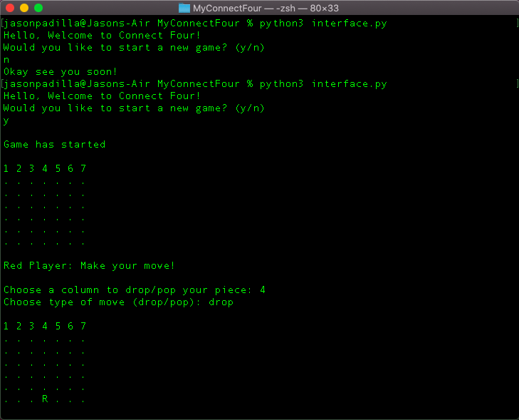
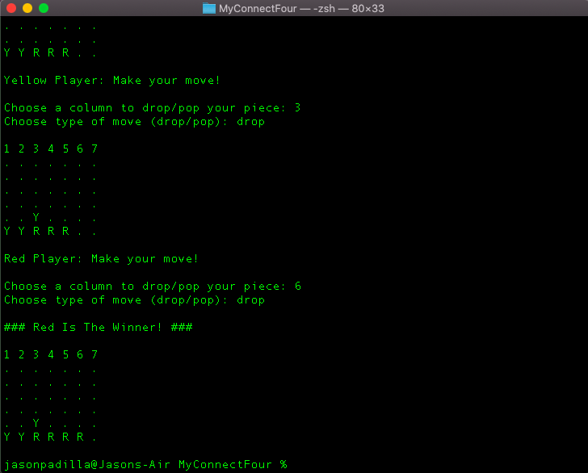

# Connect Four
A python game that I created for my ICS 32 class at UCI. It uses the console as an interface and it creates the game's board using a 2D array. In place of an empty unused spot, the console displays a "." else it places either a "R" or "Y" indicating the Red player's piece or the Yellow player's piece. The program has built in error handling to deal with user miss typing. If a user enters an invalid input, the program will ask it to redo the input. Once a player has 4 their own pieces in a row, they win and the game ends.
  
# What I learned
  * How to interpet someone else's code and then use it to build a program of my own
  * Use of 2 Dimensional arrays
  * Error handling
  * Game sense and logic

# How to run
  * Run "python3 interface.py"
  * Enter "y" in the console to start the game

# Screenshots
* Beginning of the game

* End of the game

